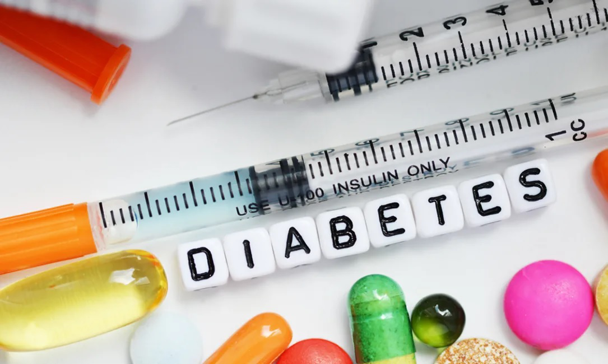

# HEALTHCARE DATA ANALYSIS: PREDICTING HOSPITAL READMISSION RATES.

## Project Description

Diabetes is a chronic disease characterized by an extended level of blood glucose in the body. It is influenced by factors such as height, race, gender, age, and sugar concentration. Early hospital readmissions in patients with diabetes pose significant challenges and impact healthcare quality.

In this project, we aim to leverage machine learning techniques to analyze a large clinical database and understand historical patterns of diabetes care in patients admitted to a US hospital. Our objective is to identify insights that can contribute to improvements in patient safety and healthcare outcomes.

By utilizing machine learning algorithms, we will develop predictive models to determine the likelihood of early hospital readmission for patients with diabetes. These models will assist healthcare professionals in intervening and providing timely and effective care to prevent readmissions.

The project will focus on data analysis, preprocessing, feature engineering, and model development. We will evaluate the performance of the models using appropriate evaluation metrics and present the findings.

Through this project, we aim to showcase how machine learning can be utilized to address the challenges caused by early hospital readmissions in diabetic patients, ultimately improving healthcare quality and patient outcomes.

## Business Problem and Constraints
## Business Problem

The business problem we aim to address is the high rate of readmissions among patients with diabetes in the United States.

**Background:** It is estimated that 9.3% of the population in the United States has diabetes, with 28% of cases going undiagnosed. The readmission rates for diabetic patients are alarmingly high, with a 30-day readmission rate ranging from 14.4% to 22.7%. The rates of readmissions beyond 30 days are even higher, with over 26% of diabetic patients being readmitted within 3 months and 30% within 1 year. These frequent readmissions result in significant healthcare costs, with an estimated $124 billion associated with the hospitalization of diabetic patients in the USA. Of this, $25 billion is attributable to 30-day readmissions assuming a 20% readmission rate.

## Constraints

1. **Interpretability of Model**: In the healthcare domain, interpretability of the model is crucial. It is essential to understand why the model predicts a patient's readmission to provide clear explanations to healthcare professionals and patients.

2. **Latency is not Strictly Important**: Most healthcare-related applications are not latency-dependent. While timely predictions are valuable, the focus is primarily on accuracy and interpretability rather than real-time response.

3. **High Cost of Misclassification**: Misclassification of readmission decisions can have significant financial implications. Incorrectly predicting readmission for patients who don't require it can put a financial burden on them. Conversely, failing to predict readmission for patients who need it can lead to increased readmission costs for hospitals. Therefore, minimizing the misclassification rate is critical.

## **Data Overview**
## **Data Overview**

The dataset used for this project is sourced from the Health Facts database, a national data warehouse maintained by Cerner Corporation in Kansas City, MO. This database collects comprehensive clinical records from hospitals across the United States.

**Dataset Filtering Criteria:** The dataset has been filtered based on the following criteria:

1. It includes inpatient encounters, which are hospital admissions.
2. It focuses on "diabetic" encounters, where any type of diabetes was diagnosed during the encounter.
3. The length of stay ranges from 1 day to 14 days.
4. Laboratory tests were performed during the encounter.
5. Medications were administered during the encounter.

By applying these criteria, approximately 100,000 records have been identified for further analysis.

The dataset comprises 55 features, including gender, weight, encounter ID, and readmission status. It can be utilized for classification and clustering tasks. The project goal is to predict whether a patient will be readmitted after treatment or not, which falls under a classification task.

**Feature Description:**

- Encounter ID: Unique identifier of an encounter
- Patient number: Unique identifier of a patient
- Race: Values include Caucasian, Asian, African American, Hispanic, and other
- Gender: Values include male, female, and unknown/invalid
- Age: Grouped in 10-year intervals (e.g., 0-10, 10-20, ..., 90-100)
- Weight: Weight in pounds
- Admission type: Integer identifier corresponding to 9 distinct values, such as emergency, urgent, elective, newborn, and not available
- Discharge disposition: Integer identifier corresponding to 29 distinct values, including discharged to home, expired, and not available
- Admission source: Integer identifier corresponding to 21 distinct values, such as physician referral, emergency room, and transfer from a hospital
- Time in hospital: Integer representing the number of days between admission and discharge
- Payer code: Integer identifier corresponding to 23 distinct values, such as Blue Cross/Blue Shield, Medicare, and self-pay Medical
- Medical specialty: Integer identifier corresponding to 84 distinct values, including cardiology, internal medicine, family/general practice, and surgeon
- Number of lab procedures: Number of lab tests performed during the encounter
- Number of procedures: Numeric value representing the number of procedures (other than lab tests) performed during the encounter
- Number of medications: Number of distinct generic names administered during the encounter
- Number of outpatient visits: Number of outpatient visits by the patient in the year preceding the encounter
- Number of emergency visits: Number of emergency visits by the patient in the year preceding the encounter
- Number of inpatient visits: Number of inpatient visits by the patient in the year preceding the encounter
- Diagnosis 1: The primary diagnosis coded as the first three digits of ICD9; includes 848 distinct values
- Diagnosis 2: Secondary diagnosis coded as the first three digits of ICD9; includes 923 distinct values
- Diagnosis 3: Additional secondary diagnosis coded as the first three digits of ICD9; includes 954 distinct values
- Number of diagnoses: Number of diagnoses entered into the system (0%)
- Glucose serum test result: Indicates the range of the result or if the test was not taken. Values include ">200," ">300," "normal," and "none" if not measured
- A1c test result: Indicates the range of the result or if the test was not taken. Values include ">8" (greater than 8%), ">7" (greater than 7% but less than 8%), "normal" (less than 7%), and "none" if not measured
- Change of medications: Indicates if there was a change in diabetic medications (dosage or generic name). Values include "change" and "no change"
- Diabetes medications: Indicates if any diabetic medication was prescribed. Values include "yes" and "no"
- 24 different kinds of medical drugs
- Readmitted: Days to inpatient readmission. Values include "❤0" (readmitted in less than 30 days), ">30" (readmitted in more than 30 days), and "No" for no record of readmission.

## **Statistically Significant Features**
After conducting statistical analysis, we identified the following statistically significant features:

- age
- discharge_disposition_id
- admission_source_id
- time_in_hospital
- num_lab_procedures
- num_procedures
- num_medications
- diag_1
- diag_2
- diag_3
- number_diagnoses
- max_glu_serum
- A1Cresult
- metformin
- repaglinide
- glimepiride
- glipizide
- pioglitazone
- insulin
- change
- diabetesMed
- readmitted
- num_total_visits

These features were found to have statistical significance in relation to the dataset and are potentially important for further analysis and modeling.

Additionally, we observed that there were some medicines that were administered to a very small fraction of the total diabetic patients who visited the hospital (about 0.01 of the total population). To ensure the dataset's quality and avoid potential biases, we decided to drop these medicines if they are categorized as "statistically insignificant features" since they were dispensed to only a small number of patients.

Please refer to the the notebook for detailed information on the dataset and its features.

## **Modells used.**
#### **1. Dummy Model**
A Dummy Model is a basic and simple model used as a benchmark for comparison with more complex models. It makes predictions based on simple rules or random guessing, without considering any relationships or patterns in the data. While it may not provide accurate predictions, it helps in understanding the minimum performance level that a model should exceed.

#### **2.Random Forest**
Random Forest is a machine learning algorithm that combines multiple decision trees to create a powerful predictive model. Each decision tree is constructed by randomly selecting features and splitting the data based on those features. The final prediction is made by aggregating the predictions of all the individual trees. Random Forest is known for its ability to handle complex relationships, handle high-dimensional data, and provide feature importance rankings.

#### **3.Decision tree**
A Decision Tree is a simple yet effective machine learning algorithm that represents a series of decisions or classifications based on features of the data. It partitions the data into subsets based on the selected features and creates a tree-like structure to make predictions. Each internal node of the tree represents a decision based on a feature, and each leaf node represents a class label or an outcome. Decision Trees are easy to understand and interpret, making them suitable for tasks where interpretability is important.

## Evaluation
The  **Dummy Model** evaluation results are as follows:

Accuracy: 0.882
The confusion matrix shows that all predictions are in the majority class (0), and none are in the minority class (1).
The model has a precision, recall, and F1-score of 0 for the minority class (1), indicating it does not correctly predict this class.
Overall, the model achieved an accuracy of 0.882 but had poor performance in predicting the minority class.

The **Decision tree** model evaluations are as follows:

Training Score: 0.938
Test Score: 0.934
The model performed well on both the training and test data, achieving high scores. It accurately predicted the majority class (0) and the minority class (1) with good precision, recall, and F1-score. The overall accuracy of the model is 93%, demonstrating its ability to make correct predictions.

The evaluations for **Random Forest** model are as follows:

Training Score: 0.999
Test Score: 0.936
The model achieved extremely high scores on both the training and test data, indicating its excellent performance. It accurately predicted the majority class (0) and the minority class (1) with high precision, recall, and F1-score. The overall accuracy of the model is 94%, demonstrating its ability to make accurate predictions.

## Results

## Dependencies

## Usage

## Contributing

We welcome contributions from the community to improve and enhance our project. If you are interested in contributing, please follow the guidelines below:

1. **Fork** the [repository](https://github.com/HersiYussuf/Capstone_Project.git) by clicking on the "Fork" button.
2. Clone the forked repository to your local machine using the following command:
3. Create a new branch for your feature or bug fix:

### **or**

4. Make your desired changes to the codebase, ensuring they adhere to the project's coding guidelines and best practices.
5. Write appropriate **tests** to cover your changes and ensure that the existing test suite passes successfully.
6. Commit your changes with a clear and descriptive commit message:
7. Push your branch to your forked repository:
8. Submit a **Pull Request (PR)** to the main repository by visiting the [Pull Requests](https://github.com/HersiYussuf/Capstone_Project/pulls) page of the original repository. Outline the changes you have made and provide any relevant information.
9. Engage in discussions with the project maintainers and address any feedback or changes requested.
10. Once approved, your changes will be merged into the main repository.
11. Congratulations! You have successfully contributed to the project.

Please note that by contributing to this project, you agree to abide by the project's [Code of Conduct](https://docs.github.com/en/site-policy/github-terms/github-event-code-of-conduct). Be respectful and considerate when interacting with the community.

If you have any questions or need further assistance, please reach out to us through [contact information or preferred communication channels].

We appreciate your contributions and look forward to your involvement in making this project better!

## License
## License

This project is licensed under the [MIT License](https://opensource.org/licenses/MIT). By contributing to this project, you agree to the terms and conditions of this license.

For more information, please refer to the [LICENSE](https://github.com/HersiYussuf/Capstone_Project/blob/main/LICENSE) file.

## Authors

- Daniel Ekale
- Edna Wanjiku
- Robert Mbugua
- Yussuf Hersi
- Aaron Onserio
- Jimcollins Wamae
- Emily Njue

## Contact

